# PPTX Extraction: 감자샐러드 샌드위치_약수_v1.3 (1)

---

## Slide 1

강사 소개 한혜숙 요리와 베이킹을 좋아해서 30 년 야매 베이킹 인생에 마침표를 찍은 여자 라일락의 작업실 대표 제과제빵 소품 전문 제작 , 베이킹 강의 전문분야 제과제빵 , 천연 발효빵 , 케이크 디자인

---

## Slide 2

강사 이력 2025 2024 산곡초 학부모교육 파운드케이크 서부초 출판의 날 간식만들기 콘 쿠키 , 당근머핀 2024 2024 서부초 학부모교육 초코머핀 , 오트밀 초코칩쿠키 , 파운드케이크 감일초 5 학년 생태교육 고구마 머핀 감일초 학부모교육 누구나 라쟈나 , 그리스식 샐러드 202 3 산곡초 학부모교육 누구나 라쟈나 , 그리스식 샐러드 202 3 제빵기능사 자격 취득 202 2 20 14 퍼스트아카데미 제과제빵 수료 하남발도르프 숲골어린이집 대표 20 10 아토피 환아용 찐빵 종로호텔제과직업전문학교 케이크디자인 , 천연발효빵 수료 천연발효빵 마스터 자격 취득 아동건강생활 코치 양성과정 수료 아동요리지도사 1급 아동교육지도사 1급 202 5 202 3 남한중 학부모 교육 모카 파운드 케이크 강의 이력 강사 정보 수상 경력 2025 2024 202 3 한벛재단 20 년 기부 감사장 국회의원 표창장 202 3 하남시장 감사장

---

## Slide 3

곰돌이 마들렌 오늘은 귀여운 곰돌이 모양의 마들렌을 만들어 보겠습니다 . 우유버터 , 비정제 원당 , 유기농 박력분 , 무항생제 달걀을 주재료로 만든 곰돌이 마들렌에 초코펜으로 장식해 보아요

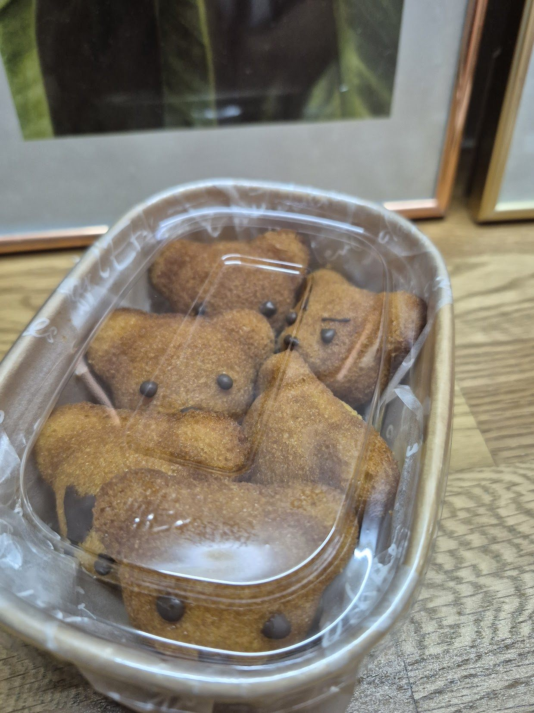

---

## Slide 4

재료 소개 우유버터 200g 설탕 200g 유기농 박력분 200g 달걀 200g 베이킹파우더 4g 소금 1g

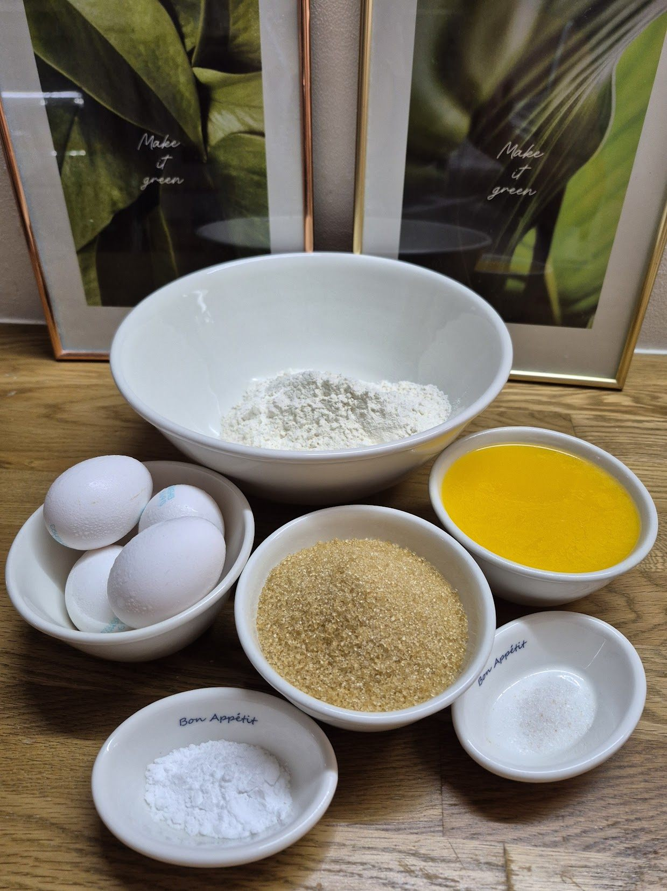

---

## Slide 5

만드는 순서 달걀에 설탕을 넣고 섞기

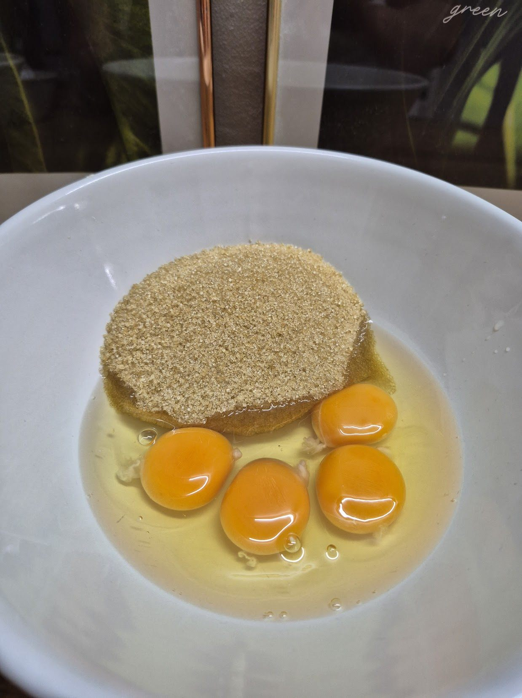

---

## Slide 6

만드는 순서 박력분 , 베이킹 파우더 , 소금을 체친 후 설탕 , 달걀물에 넣어 섞는다

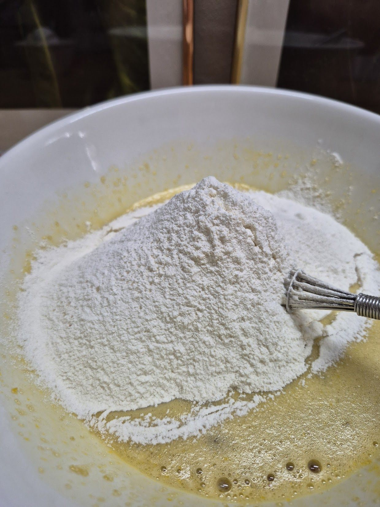

---

## Slide 7

만드는 순서 잘 섞은 반죽에 녺인 버터를 넣고 섞는다 .

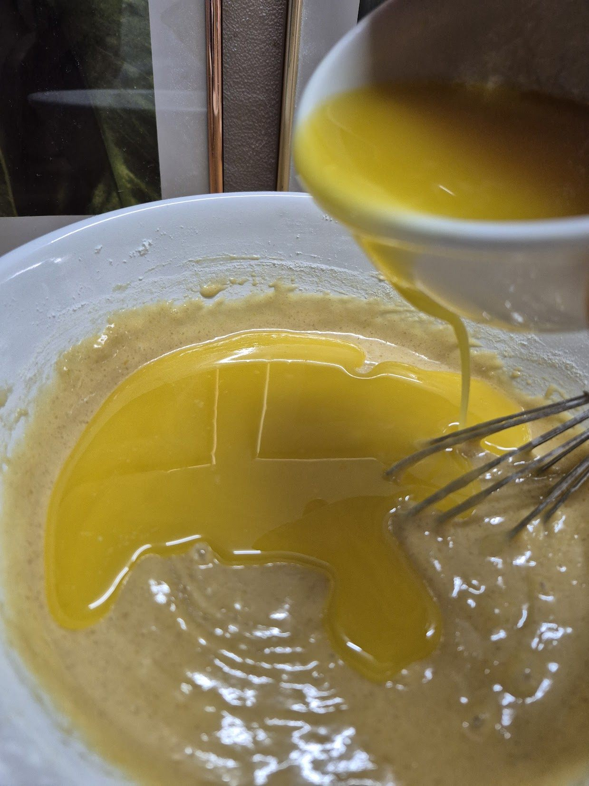

---

## Slide 8

만드는 순서 짤 주머니에 넣고 30 분간 휴지한다 .

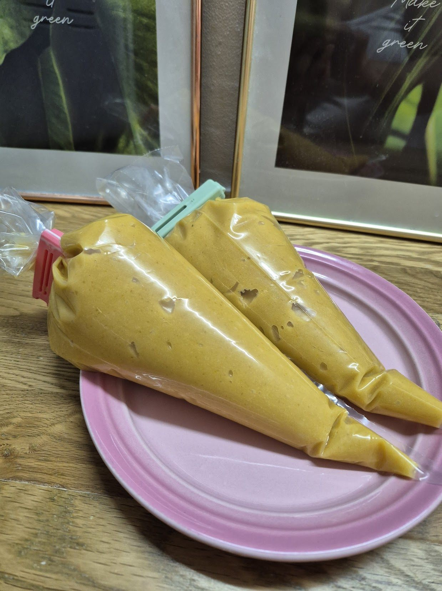

---

## Slide 9

만드는 순서 곰돌이 마들렌 팬에 팬닝한다 .

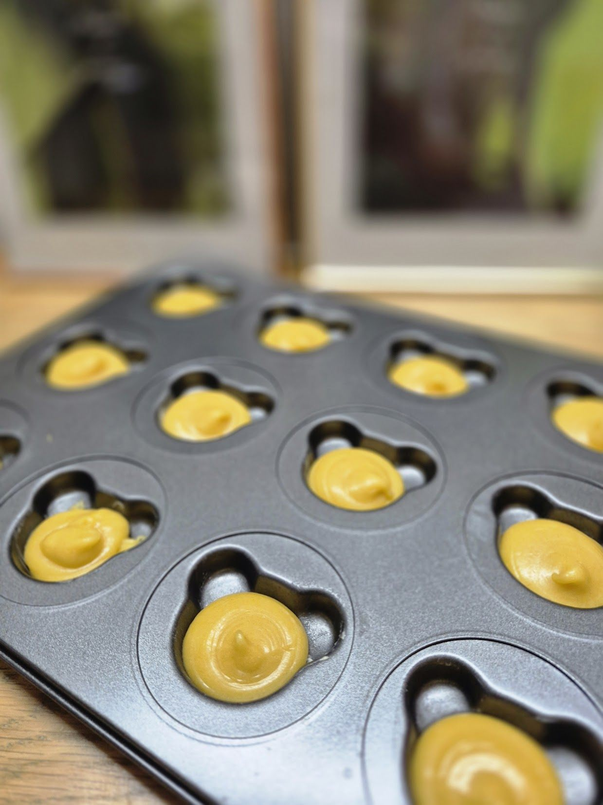

---

## Slide 10

만드는 순서 180 도에서 10~15 분 간 굽는다 .

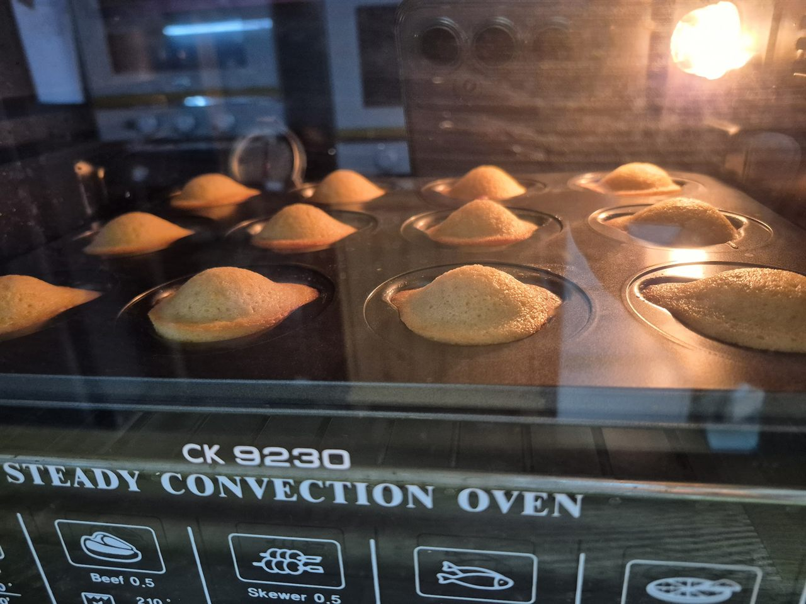

---

## Slide 11

만드는 순서 식힘망에서 충분히 식힌다 .

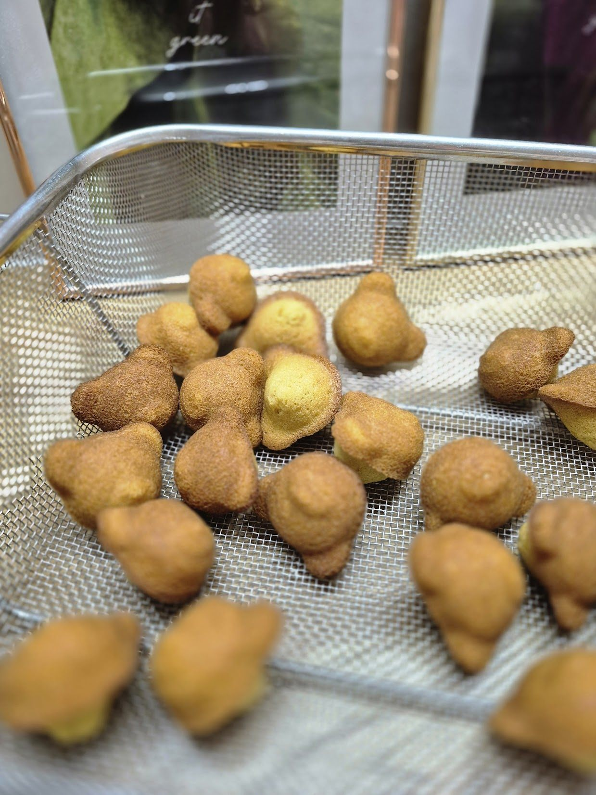

---

## Slide 12

만드는 순서 초코펜으로 곰돌이 얼굴을 장식한다 .

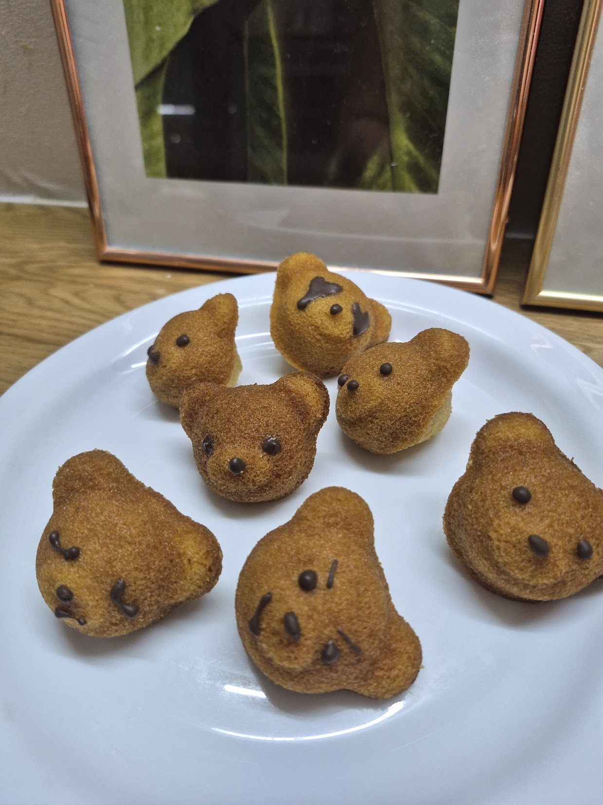

---

## Slide 13

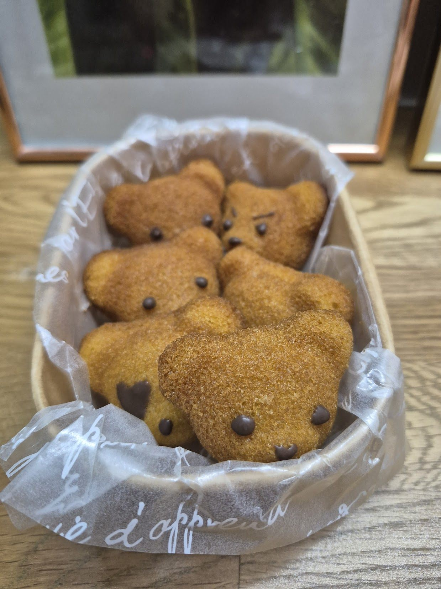

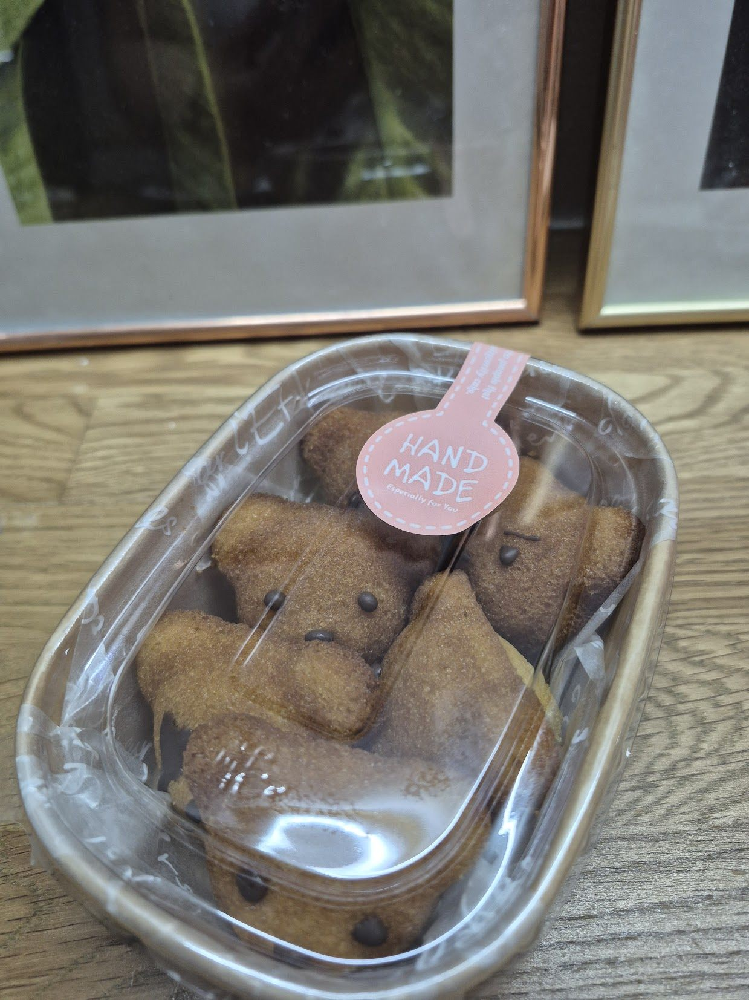

