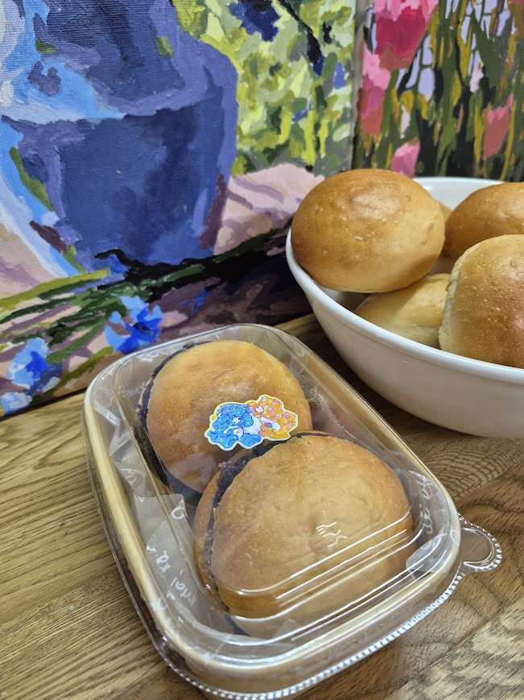
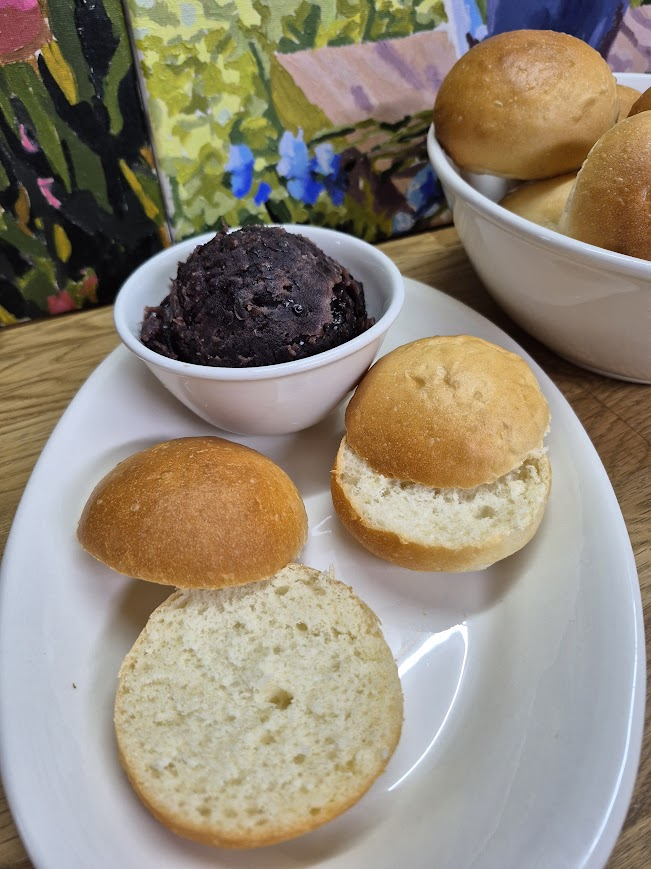
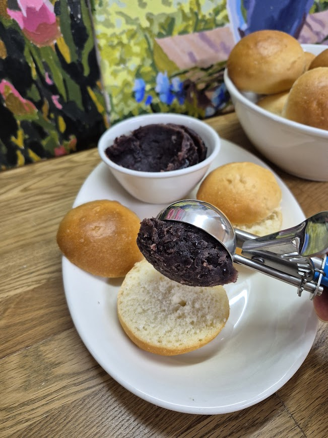
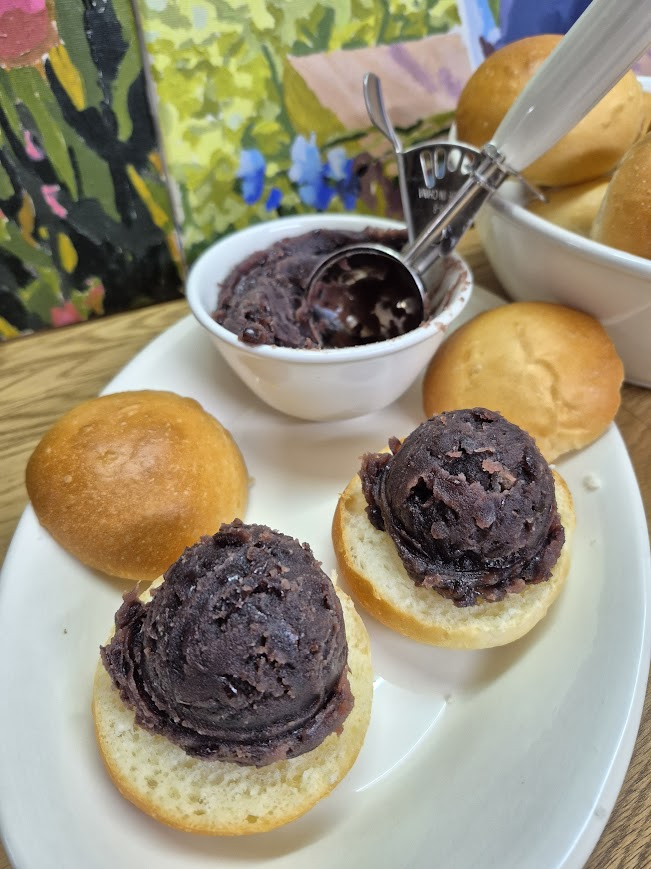
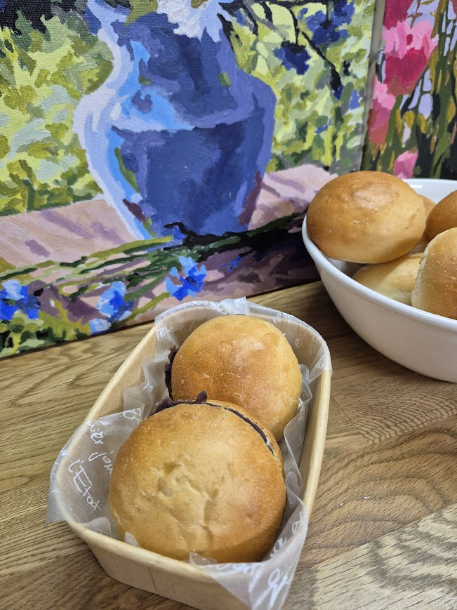

# PPTX Extraction: 오픈단팥빵_약수_v1.0 (강사 소개 통합본)

---

## Slide 1

강사 소개 한혜숙 요리와 베이킹을 좋아해서 30 년 야매 베이킹 인생에 마침표를 찍은 여자 라일락의 작업실 대표 제과제빵 소품 전문 제작 , 베이킹 강의 전문분야 제과제빵 , 천연 발효빵 , 케이크 디자인

---

## Slide 2

강사 이력 2025 2024 산곡초 학부모교육 파운드케이크 서부초 출판의 날 간식만일기 콘 쿠키 , 당근머핀 2024 2024 서부초 학부모교육 초코머핀 , 오트밀 초코칩쿠키 , 파운드케이크 감일초 5 학년 생태교육 고구마 머핀 감일초 학부모교육 누구나 라쟈나 , 그리스식 샐러드 202 3 산곡초 학부모교육 누구나 라쟈나 , 그리스식 샐러드 202 3 제빵기능사 자격 취득 202 2 20 14 퍼스트아카데미 제과제빵 수료 하남발도르프 숲골어린이집 대표 20 10 아토피 환아용 찐빵 종로호텔제과직업전문학교 케이크디자인 , 천연발효빵 수료 천연발효빵 마스터 자격 취득 아동건강생활 코치 양성과정 수료 아동요리지도사 1급 아동교육지도사 1급 202 5 202 3 남한중 학부모 교육 모카 파운드 케이크 강의 이력 강사 정보 수상 경력 2025 2024 202 3 한벛재단 20 년 기부 감사장 국회의원 표창장 202 3 하남시장 감사장

---

## Slide 3

오픈 단팥빵 안녕하세요 ! 오늘은 직접 만든 모닝빵과 달달한 통팥을 이용해 오픈 단팥빵을 만들어 보겠습니다 .

---

## Slide 4

모닝빵 가르기 직접 만든 폭신한 모닝빵을 반으로 갈라 뚜껑을 분리해 주세요

---

## Slide 5

단팥 앙금넣기 반으로 가른 모닝빵에 단팥앙금을 듬뿍넣어주세요

---

## Slide 6

초코펜으로 장식하고 포장하기 초코펜으로 오픈 단팥빵 뚜껑에 그리고 싶은 그림을 그려주세요 종이 도시락에 유산지를 깔고 오픈 단팥빵을 넣어 주세요

