# PPTX Extraction: 보우짱 크럼블 머핀_약수_v1.0 (강사 소개 통합본)

---

## Slide 1

강사 소개 한혜숙 요리와 베이킹을 좋아해서 30년 야매 베이킹 인생에 마침표를 찍은 여자 라일락의 작업실 대표 제과제빵 소품 전문 제작, 베이킹 강의 전문분야 제과제빵, 천연 발효빵, 케이크 디자인

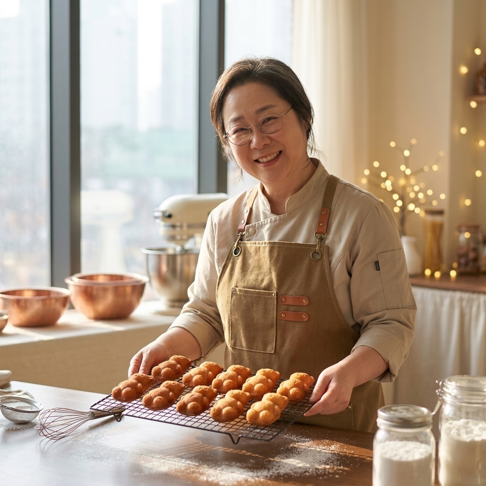

---

## Slide 2

강사 이력 2025 2024 산곡초 학부모교육 파운드케이크 서부초 출판의 날 간식만들기 콘 쿠키, 당근머핀 2024 2024 서부초 학부모교육 초코머핀, 오트밀 초코칩쿠키, 파운드케이크 감일초 5학년 생태교육 고구마 머핀 감일초 학부모교육 누구나 라쟈나, 그리스식 샐러드 2023 산곡초 학부모교육 누구나 라쟈나, 그리스식 샐러드 2023 제빵기능사 자격 취득 2022 2014 퍼스트아카데미 제과제빵 수료 하남발도르프 숲골어린이집 대표 2010 아토피 환아용 찐빵 종로호텔제과직업전문학교 케이크디자인, 천연발효빵 수료 천연발효빵 마스터 자격 취득 아동건강생활 코치 양성과정 수료 아동요리지도사 1급 아동교육지도사 1급 2025 2023 남한중 학부모 교육 모카 파운드 케이크 강의 이력 강사 정보 수상 경력 2025 2024 2023 한벛재단 20년 기부 감사장 국회의원 표창장 2023 하남시장 감사장

---

## Slide 3

보우짱 크럼블 머핀 안녕하세요! ‘보우짱’은 일본어로 ‘도련님/아이’라는 뜻으로 작고 앙증맞은 단호박을 귀엽게 부르는 명칭이에요. 오늘은 포근하고 달콤한 그 보우짱과 크럼블로 머핀을 만들어 볼게요.

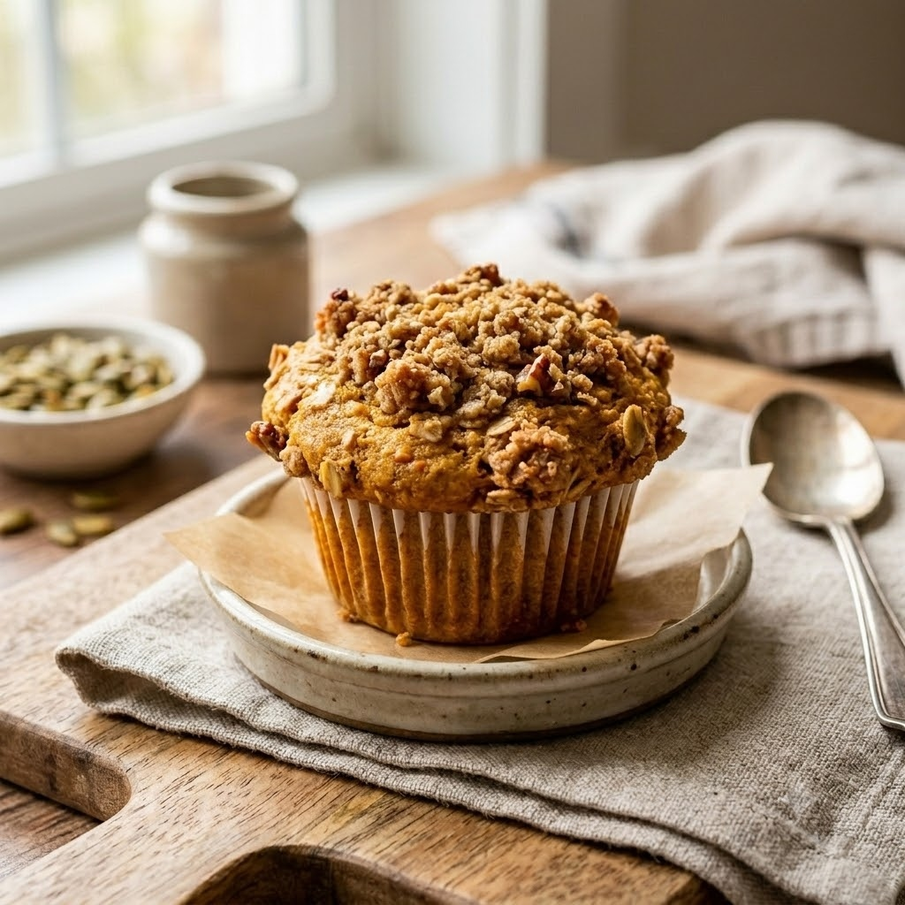

---

## Slide 4

준비물 버터, 비정제 원당, 무항생제 달걀, 유기농 박력분, 소금, 베이킹 파우더, 베이킹 소다, 보우짱, 소보로

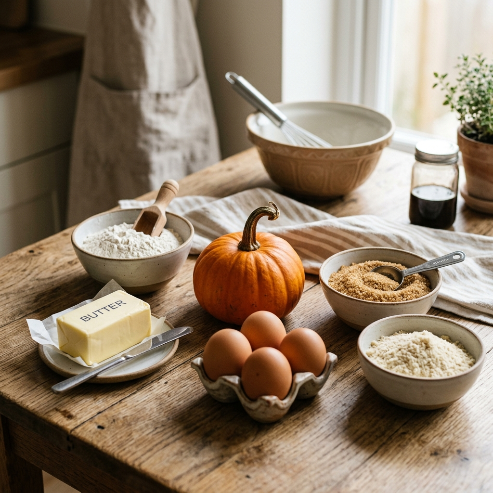

---

## Slide 5

[1단계] 보우짱 단호박 손질 및 찌기 보우짱 미니 단호박을 깨끗이 씻어 렌지에 2분간 돌려 부드럽게 한 뒤 씨를 제거하고, 일부는 찜기에 쪄서 으깨고 일부는 깍둑썰기합니다.

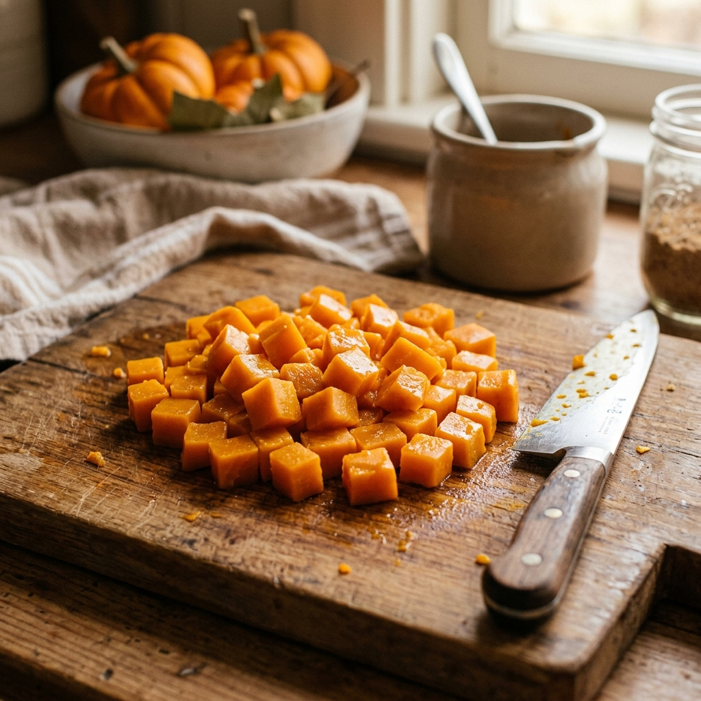

---

## Slide 6

[2단계] 가루류 체치기 박력분, 소금, 베이킹 파우더, 베이킹 소다를 체에 쳐서 준비.

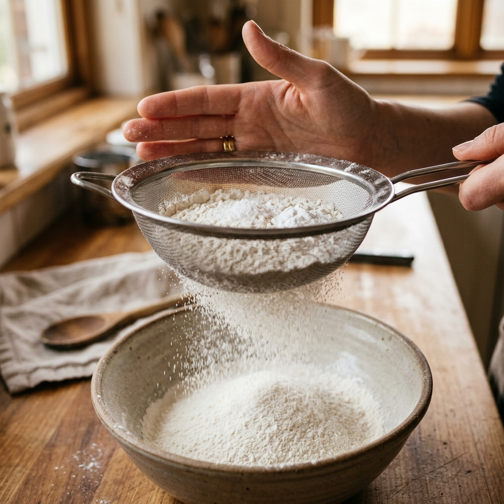

---

## Slide 7

[3단계] 머핀 반죽 만들기 실온의 버터와 설탕을 크림화한 후 달걀을 나눠 넣고, 체친 박력분과 베이킹파우더, 으깬 단호박 퓌레를 가볍게 섞어줍니다.

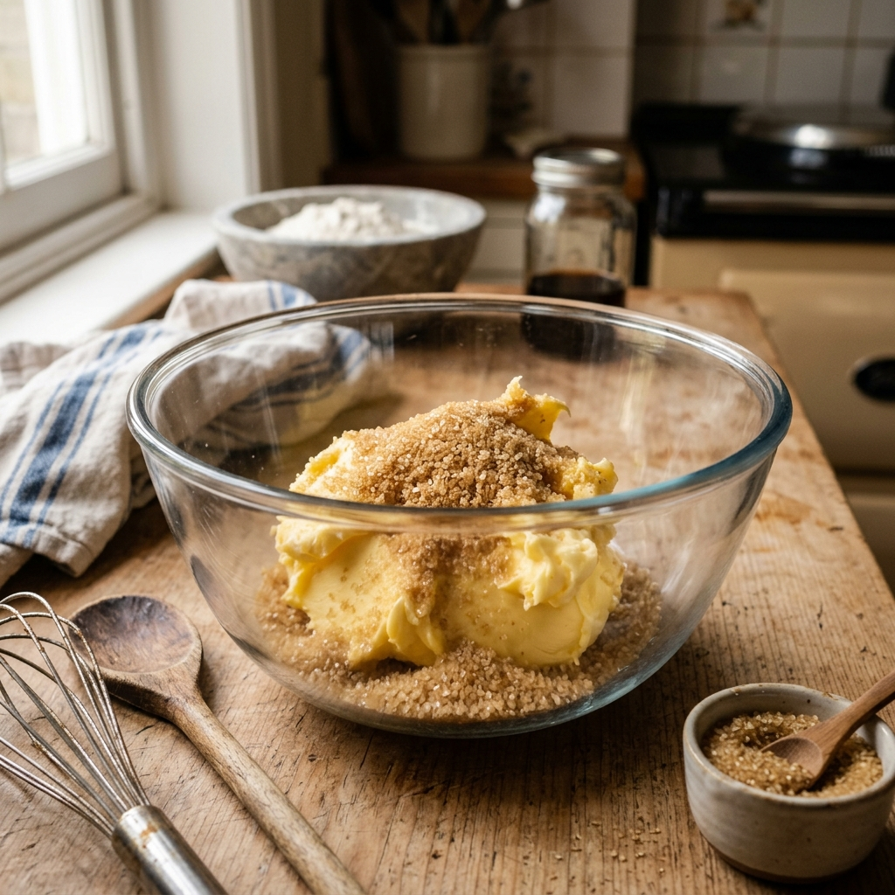

---

## Slide 8

[4단계] 달걀 넣고 섞기 크림화한 버터에 달걀을 넣고 섞기.

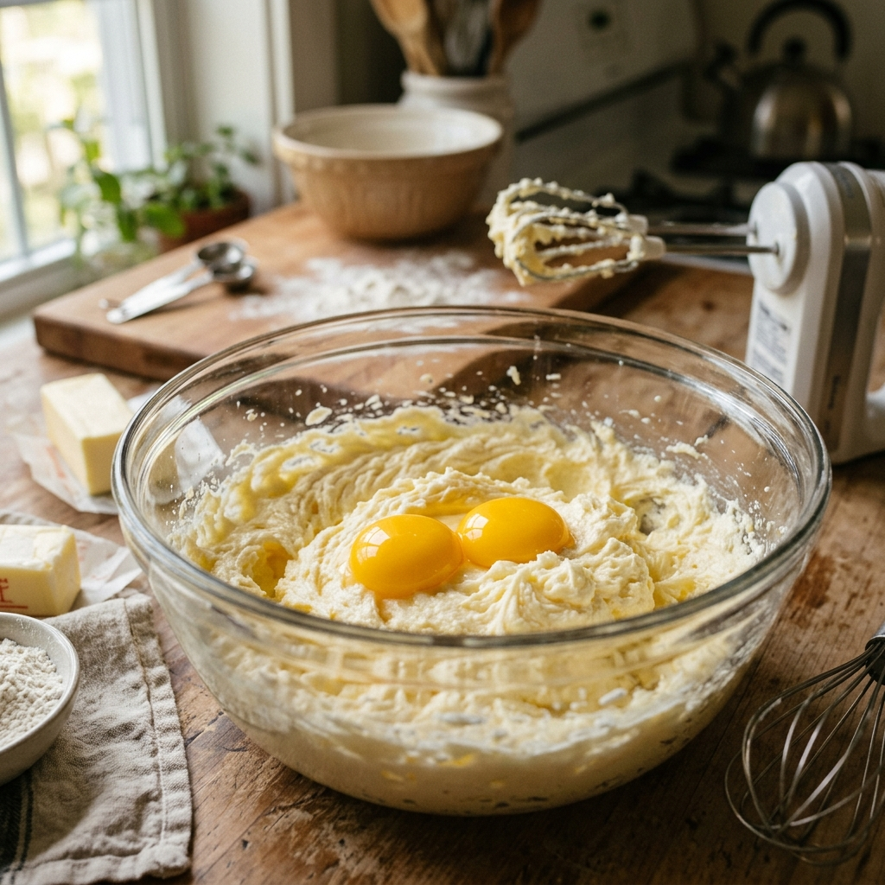

---

## Slide 9

[5단계] 가루류 넣어 섞기 체에 친 가루류 넣어 섞기.

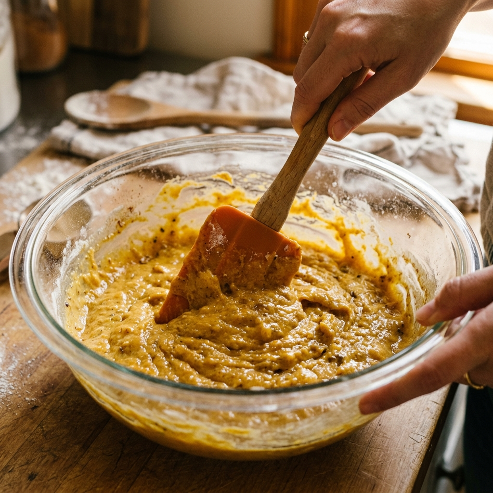

---

## Slide 10

[6단계] 보우짱 넣어 섞기 보우짱 넣어 섞기.

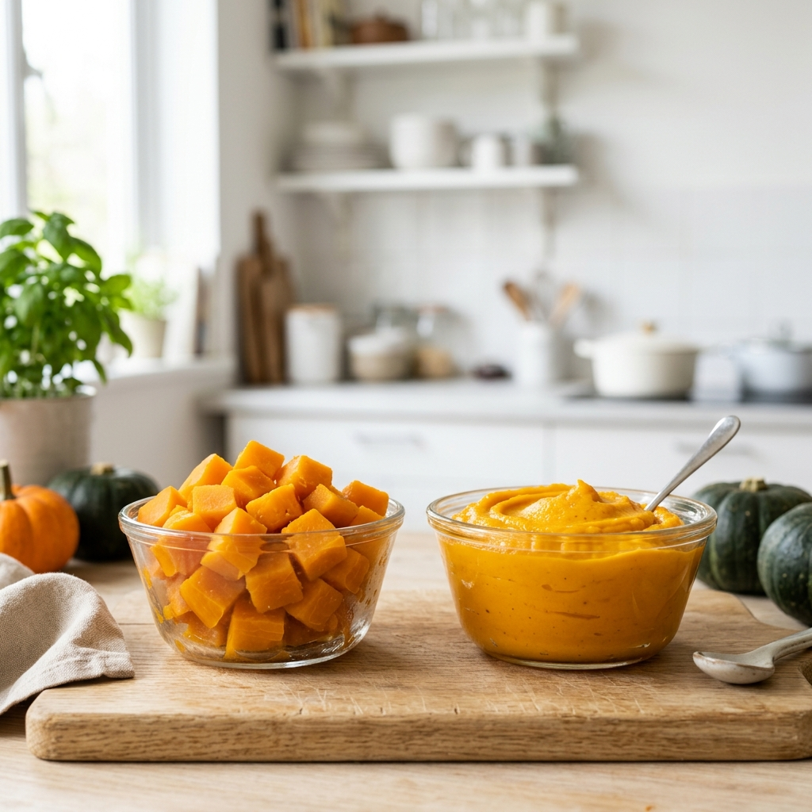

---

## Slide 11

[7단계] 팬닝 및 크럼블 뿌리기 머핀팬에 70%만 팬닝하고 크럼블 뿌리기.

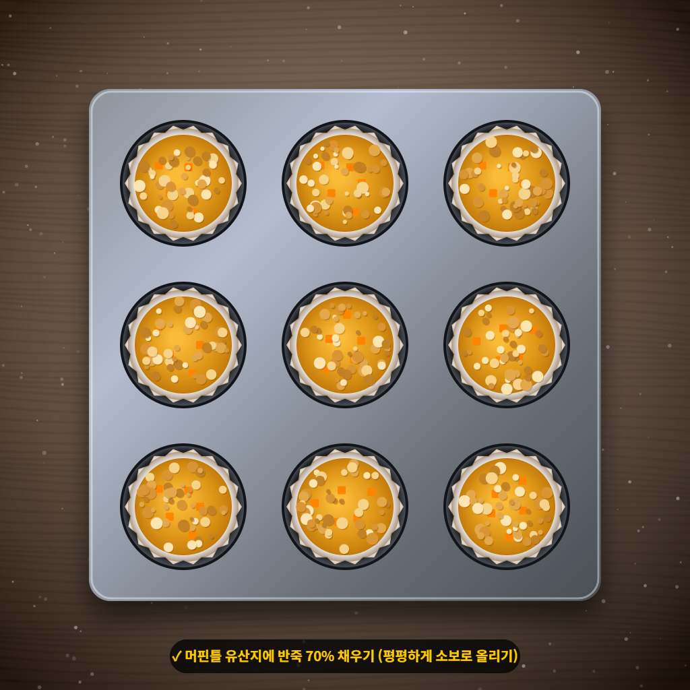

---

## Slide 12

[8단계] 오븐에 굽기 및 완성 180도에서 20~30분 굽기.

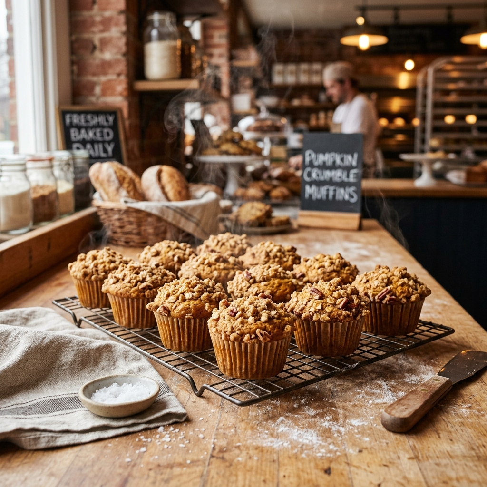
