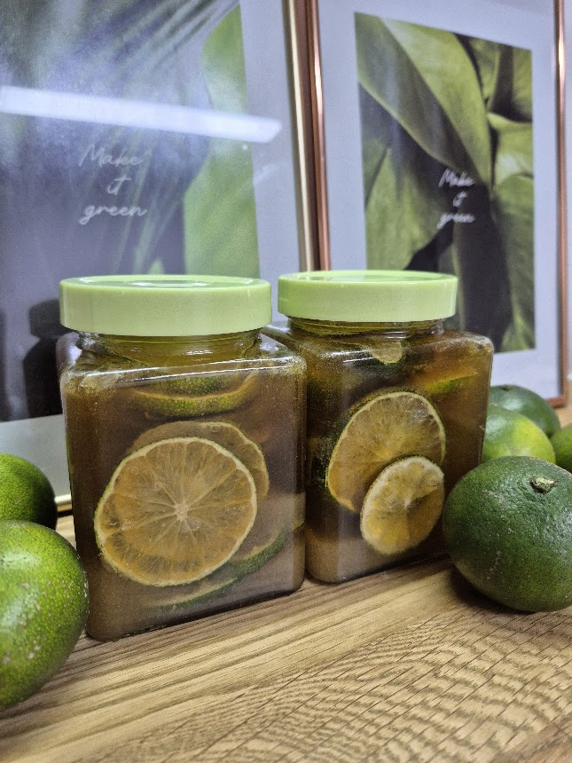
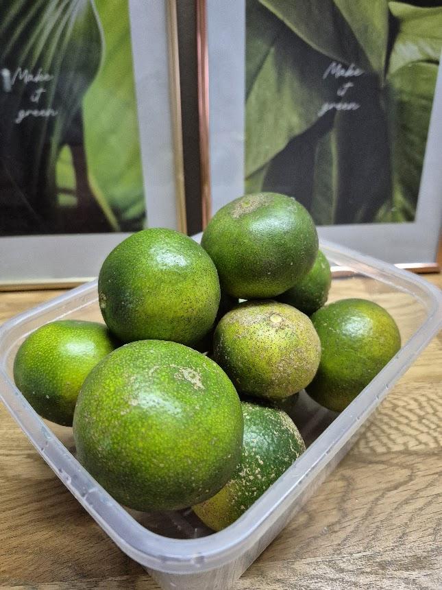
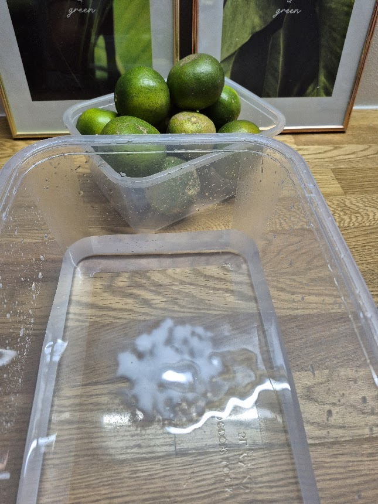
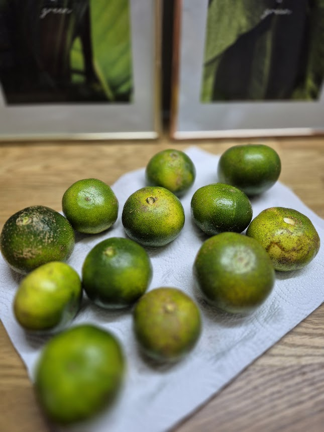
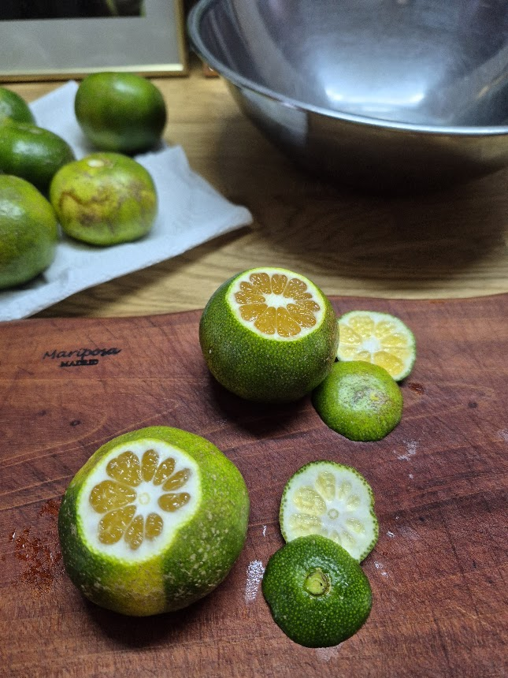
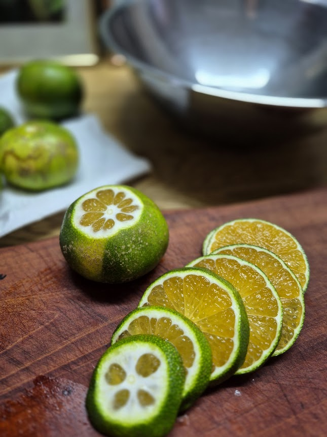
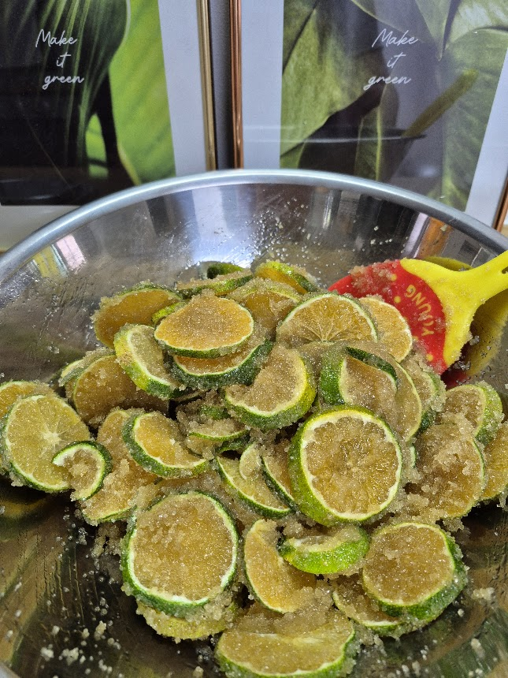
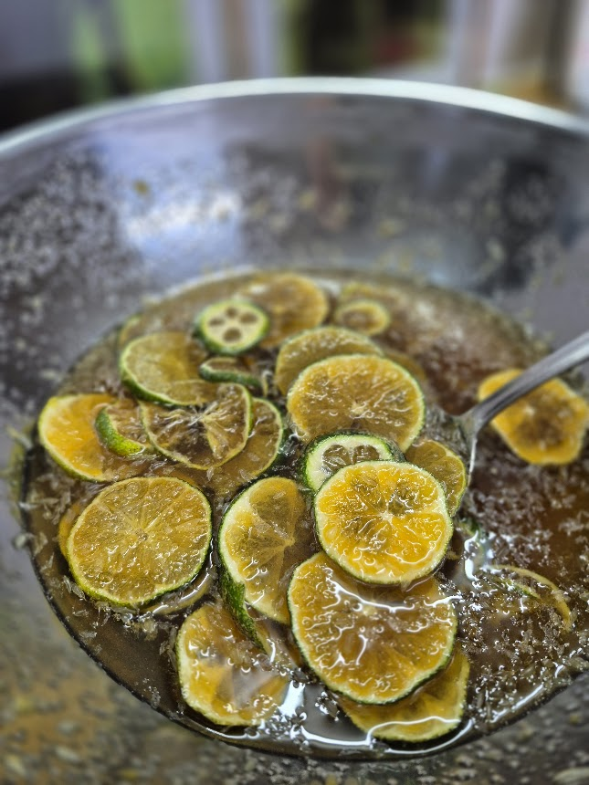
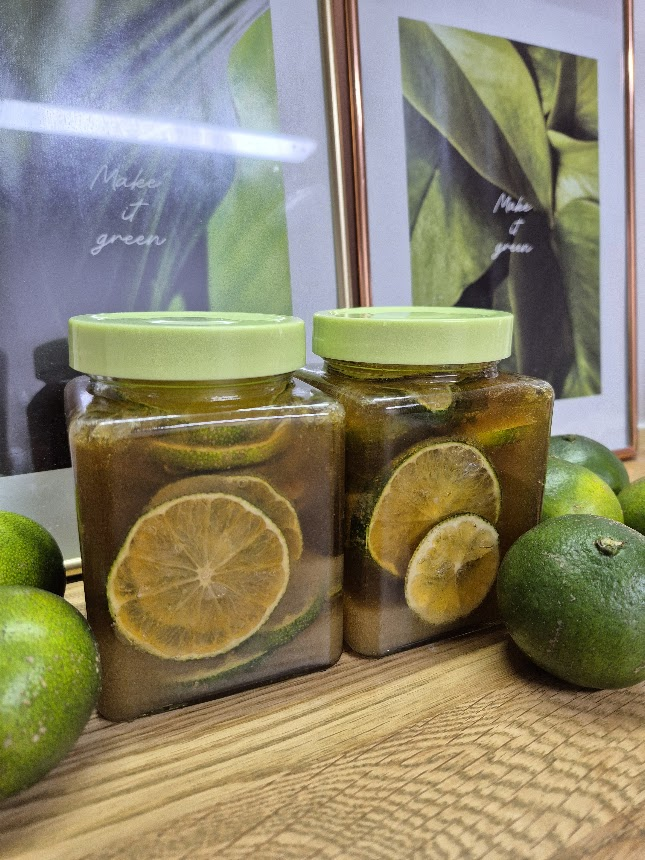
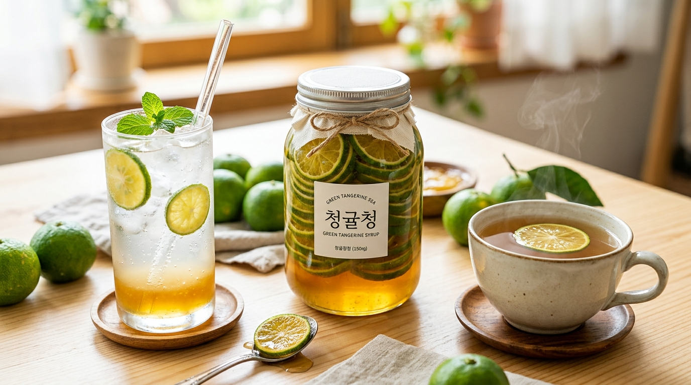

# PPTX Extraction: 청귤청 만들기 (강사 소개 통합본)

---

## Slide 1

강사 소개 한혜숙 요리와 베이킹을 좋아해서 30년 야매 베이킹 인생에 마침표를 찍은 여자 라일락의 작업실 대표 제과제빵 소품 전문 제작, 베이킹 강의 전문분야 제과제빵, 천연 발효빵, 케이크 디자인

---

## Slide 2

강사 이력 2025 2024 산곡초 학부모교육 파운드케이크 서부초 출판의 날 간식만들기 콘 쿠키, 당근머핀 2024 2024 서부초 학부모교육 초코머핀, 오트밀 초코칩쿠키, 파운드케이크 감일초 5학년 생태교육 고구마 머핀 감일초 학부모교육 누구나 라쟈나, 그리스식 샐러드 2023 산곡초 학부모교육 누구나 라쟈나, 그리스식 샐러드 2023 제빵기능사 자격 취득 2022 2014 퍼스트아카데미 제과제빵 수료 하남발도르프 숲골어린이집 대표 2010 아토피 환아용 찐빵 종로호텔제과직업전문학교 케이크디자인, 천연발효빵 수료 천연발효빵 마스터 자격 취득 아동건강생활 코치 양성과정 수료 아동요리지도사 1급 아동교육지도사 1급 2025 2023 남한중 학부모 교육 모카 파운드 케이크 강의 이력 강사 정보 수상 경력 2025 2024 2023 한벛재단 20년 기부 감사장 국회의원 표창장 2023 하남시장 감사장

---

## Slide 3

**메인 메시지: 무농약 청귤과 비정제 원당으로 건강한 청귤청을 만든다.**

오늘은 무농약 청귤과 비정제 원당으로 청귤청을 만들어 보겠습니다. 농약, 제초제 등을 사용하지 않아 덕지가 붙어 있지만 더 건강한 청귤, 첨가물 없이 정제하지 않고 사탕수수 즙으로 만든 원당을 재료로 건강한 청귤청을 함께 만들어 보아요.

---

## Slide 4

**메인 메시지: 청귤 1kg과 원당 1.2kg을 준비한다.**

재료 및 준비물: 무농약 청귤 1kg과 비정제 원당 1.2kg, 그리고 깨끗한 세척을 위한 베이킹 소다를 준비합니다. 청귤의 신맛을 잡고 장기 보관을 위해 설탕 비율을 1:1.2로 맞춥니다.

---

## Slide 5

[1단계] 베이킹 소다에 청귤 씻기 물에 베이킹 소다를 풀고 청귤을 문질러 깨끗이 씻어줍니다. 무농약 청귤의 껍질 표면의 먼지와 이물질을 깨끗이 씻어냅니다.

---

## Slide 6

[2단계] 물기 제거 키친 타올로 청귤의 겉면 물기를 꼼꼼하게 제거합니다. 물기가 남아있으면 보관 중 곰팡이가 생기기 쉬우므로 완전히 건조시켜 줍니다.

---

## Slide 7

[3단계] 꼭지와 배꼽 제거 청귤의 양쪽 끝부분인 꼭지와 배꼽 부위를 칼로 잘라냅니다. 이 부분을 함께 넣으면 청에서 쓴맛이 우러나올 수 있으므로 깔끔하게 제거합니다.

---

## Slide 8

[4단계] 청귤 슬라이스 자르기 손질된 청귤을 0.2~0.3cm 두께로 얇고 일정하게 슬라이스합니다. 너무 두꺼우면 즙이 잘 우러나지 않고, 너무 얇으면 과육이 부서질 수 있습니다.

---

## Slide 9

[5단계] 볼에 청귤과 원당 혼합하기 믹싱볼에 슬라이스한 청귤과 준비한 비정제 원당을 넣고 골고루 섞어줍니다.

---

## Slide 10

[6단계] 원당 녹을 때까지 섞기 비정제 원당은 일반 정제 설탕에 비해 결정의 크기가 크므로 완전히 녹을 때까지 시간을 두고 중간중간 저어가며 녹여줍니다.

---

## Slide 11

[7단계] 병입 포장 및 보관·숙성 열탕 소독한 유리병에 청귤이 청에 충분히 잠길 정도로 붓고 밀봉합니다. 반드시 냉장 보관하며, 100일간 저온 숙성 후 드시면 깊고 풍부한 풍미를 느낄 수 있습니다.

---

## Slide 12

**메인 메시지: 향긋하고 상큼달콤한 수제 청귤청 완성!**

🍹 **청귤 에이드**: 유리잔에 얼음과 청귤청 2~3스푼을 넣고 탄산수를 부어 시원하게 즐겨보세요.  
☕ **따뜻한 청귤차**: 찻잔에 청귤청을 넣고 따뜻한 온수를 부어 향긋한 비타민 가득 힐링 티로 드세요.

